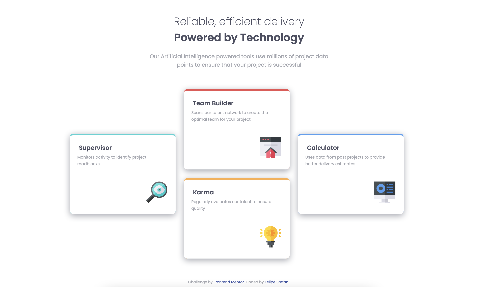

# Frontend Mentor - Four card feature section solution

This is a solution to the [Four card feature section challenge on Frontend Mentor](https://www.frontendmentor.io/challenges/four-card-feature-section-weK1eFYK). Frontend Mentor challenges help you improve your coding skills by building realistic projects. 

## Table of contents

- [Overview](#overview)
  - [The challenge](#the-challenge)
  - [Screenshot](#screenshot)
  - [Links](#links)
- [My process](#my-process)
  - [Built with](#built-with)
- [Author](#author)

## Overview

### The challenge

Users should be able to:

- View the optimal layout for the site depending on their device's screen size

### Screenshot

### Links

- Solution URL: [https://github.com/felipestefani/four-card-hero](https://github.com/felipestefani/four-card-hero)
- Live Site URL: [https://felipestefani.github.io/four-card-hero/](https://felipestefani.github.io/four-card-hero/)

## My process

### Built with

- Semantic HTML5 markup
- CSS custom properties
- Flexbox (mobile)
- CSS Grid (deskto)
- Mobile-first workflow

## Author

- Linkedin - [Felipe Stefani](https://www.linkedin.com/in/felipe-stefani-a35185116/)
- Frontend Mentor - [@felipestefani](https://www.frontendmentor.io/home)
- Instagram - [@felipestefani_mv](https://www.instagram.com/felipestefani_mv/)

